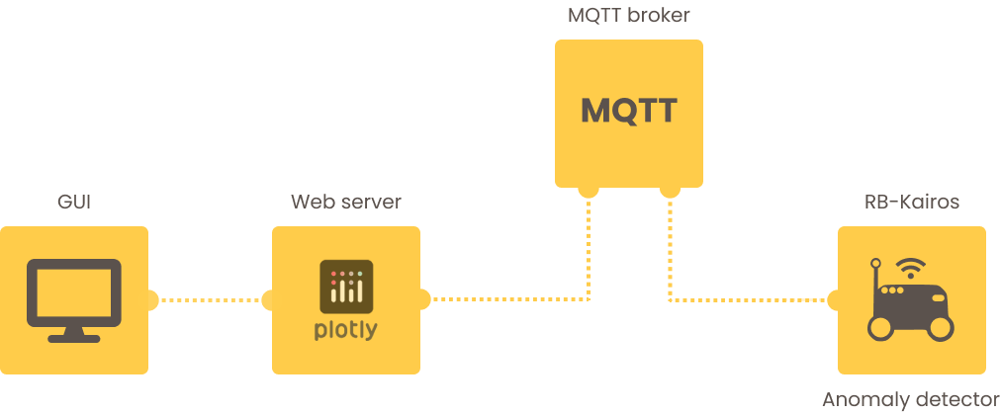

# Online Anomaly Detection for Autonomous Mobile Robots: a Real-World Application

    

The detection of anomalies in time-series data is a prevalent challenge across various domains. In this project, we introduce a practical approach for detecting unexpected behaviors in data acquired by mobile robots. The case study has been developed in the ICE Lab of the University of Verona, the laboratory of the industry 4.0 dedicated to the research of new technologies for the automation of industrial processes. The idea is to apply an already developed method on the robots available in the lab and archive the following goals:

- Apply the algorithm to a real-world scenario
- Create a user-friendly visualization tool for human operators engaged with the agents.

The used approach combines statistical and machine learning techniques to identify anomalies in the data obtained from the robot's sensors and actuators during routine operations. Specifically, it uses a Hidden Markov Model (HMM) to represent the agent's normal behavior and evaluate how the observed deviates from the expected one. To build the system, we utilized various technologies/frameworks such Python for developing the detector and web application, ROS for retrieving information from robots and MQTT for the communication between the system's components. These tools contributed to the overall effectiveness and efficiency of the system enabling accurate anomaly detection and providing a user-friendly interface for human operators interacting with the robots.

## System and Methodology
To detect abnormal behaviors in the robot, we utilize a machine learning method ([HMMs for Anomaly Detection in Autonomous Robots](https://dl.acm.org/doi/10.5555/3398761.3398779)) based on a statistical model. The approach involves comparing the current state of the robot to the expected (nominal) behavior, modeled by a Hidden Markov Model. In simple words, the probability distribution of the robot's current observation is compared with the nominal distribution using a variant of the Hellinger Distance, a function that measures dissimilarity between probability distributions. If the Hellinger Distance exceeds a certain threshold, the robot's behavior is considered anomalous. Additionally, our system can identify the variable responsible for the anomaly through Hellinger Distance decomposition.

The main challenge of this thesis was to apply the method in an industrial scenario to have a real-time system, that is easy for operators to use and deploy. In the system, three main components characterize our anomaly detector as shown in Figure below:

    

- Anomaly detector: the component that is responsible for detecting anomalies in the robot's behavior. It is a ROS node, which can be seen as a process running on the robot, that performs the computation required to detect anomalies.
- MQTT broker: the message protocol used to enable the communication between the detector and the web application is MQTT, which was already set up in the ICE Lab. The MQTT broker is responsible for receiving the messages from the anomaly detector and forwarding them to the web application.
- Web server: the web server hosts the application that is responsible for showing the robot's current position and the anomaly detection results to the operator. It is implemented using the Dash Plotly framework, which is a well-known framework for building web applications with Python.

## Environment setup
- Ubuntu 18.04
- ROS Melodic
- Python 2.7 for the anomaly detection scripts (root `requirements.txt`)
- Python 3.8 for the web interface (`web/requirements.txt`)

## Installation and run
1. Install ROS Melodic following the documentation
2. Install the packages located in `kairos_ws-robot_b_work/src/deb` 
3. Install the requirements.txt in your python2.7 (attention that the requirements.txt includes only python libraries without ROS dependencies, them are installed in the previous points)
4. Make the folder catkin_ws following the ROS documentation
5. Clone the repository in your catkin_ws/src
6. Build the workspace
7. Source the workspace
8. Run the `rosrun anomaly_detection listener.py` script
