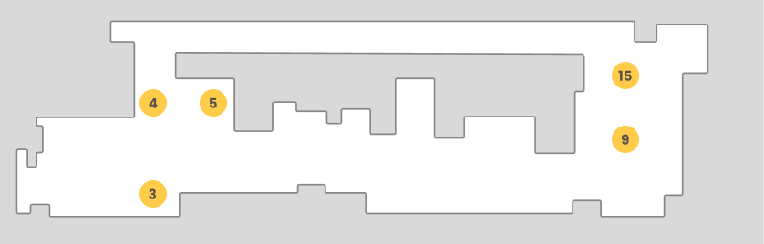

There are two folders indicating the two parts of the dataset. We can see nominal routes, where the robot behavior its normal, and anomalous routes. The waypoints specific point located in the ICE lab as shown in the following figure.

| Filename   | Waypoints          | Comment                                             |
| ---------- | ------------------ | --------------------------------------------------- |
| 01_nominal | 5 - 4 - 15 - 4     | Nominal                                             |
| 02_0606    | 3 - 4 - 15         | Anomalous                                           |
| 03_0606    | 5 - 3 - 4 - 15     | Anomalous                                           |
| 04_0606    | 15 - 4 - 3 - 5     | Nominal                                             |
| 05_0606    | 5 - 3 - 4 - 15     | Nominal                                             |
| 06_0606    | 15 - 4 - 3 - 5     | Nominal                                             |
| 07_0606    | 5 - 4 - 3 - 15     | Anomaly                                             |
| 08_0606    | 5 - 4 - 15         | Anomaly                                             |
| 09_0606    | 5 - 4 - 15 - 4     | Anomaly                                             |
| 10_0606    | 5 - 4 - 3 - 4 - 15 | Anomaly with box in the middle of the path          |
| 11_0606    | 15 - 4 - 3         | Anomaly with the box but the robot collided the box |
| 12_0606    | 5 - 4 - 3 - 4 - 15 | Nominal                                             |
| 13_0606    | 15 - 4             | Anomaly                                             |
| 01_0607    | -                  | Anomaly                                             |
| 02_0607    | 5 - 4 - 3 - 4 - 15 | Anomaly with box in the middle of the path          |
| 03_0607    | 15 - 4 - 3 - 4 - 5 | Nominal                                             |
